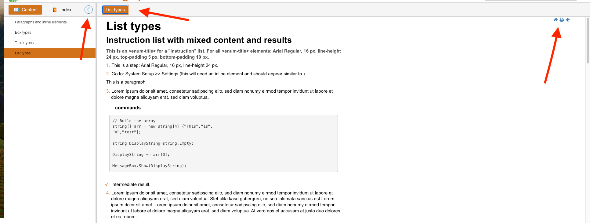

# About the task

This task is an example of day-to-day work, the given page is a simplified version of the page that you'll be working with.

We estimate the task to take from 1 to 4 hours to complete.

## Additional information

- INFO: Bootstrap and JQuery are included, can be used as necessary.
- INFO: The content of each page is loaded dynamically after the initial page viewer/container loads
  and when navigating to new content.
  - NOTE: Content loading behaves different when the page is opened from filesystem and when it's opened from a local web server.
    This does NOT affect the task, you can open the page in the way you prefer.
- LIMITATIONS:
  - All CSS changes **MUST** be done in task/resources/css/custom-style.css and no other file.
  - All JS changes **MUST** be done in task/resources/js/src/custom-scripts.js and no other file.
    - NOTE: You can still use custom-scripts.js to overwrite methods from other files if needed.
  - All other files **MUST** remain unchanged.

## Task

A. Our client requested changes to the page in order to adjust it to the new company image.
The new colors are:

- Main color: **rgb(210, 115, 29)**
- Light color variation: **rgb(255, 229, 223)**

B. The client wants to warn users before they leave the page in order to improve security.

### A. CSS Changes

1. Change the blue title in the top toolbar from blue color to the new main color.
2. Change the "Content", "Index" and "<current page>" buttons:
   1. Change buttons color to main color.
   2. Change buttons color while mouse hovering to light color.
3. Change the navigation menu items (left panel) colors to the new ones (main and light).
4. Change the icon (marker/"bullet"/etc.) color of each list type to use the main color instead of black.
5. Change table type "zebra-striped" header text color to main color.
6. Increase the left and right margins of the content section to 2 times the "<html>" element font-size.
7. Review the output and report any place where the client might have forgotten the blue color is still present.

## B. JS Changes

1. When clicking a link, a confirmation should be shown (`window.confirm(<message>)`)
   that asks the user "Are you sure that you want to leave the current site?". If user refuses, then nothing should happen,
   otherwise is redirected to the target page.

## css task 6

do not understand the "to 2 times the "<html>" element font-size" so I increase the current left and right paddings to x2

## css task 7

The color has been modified in nearly all sections, with the exception of

1. certain icons at the top of the page
2. The focus on the buttons in the upper section.
3. The left arrow icon to hide the left drawer

   
